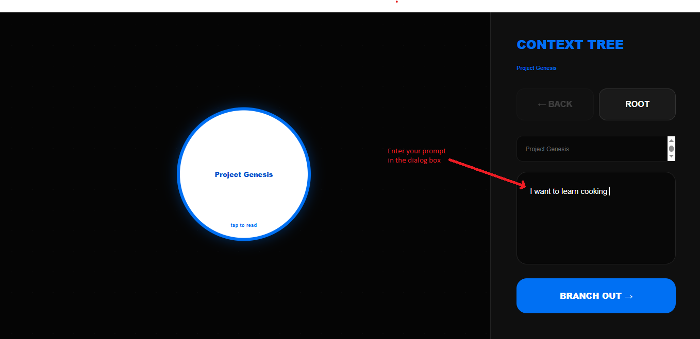
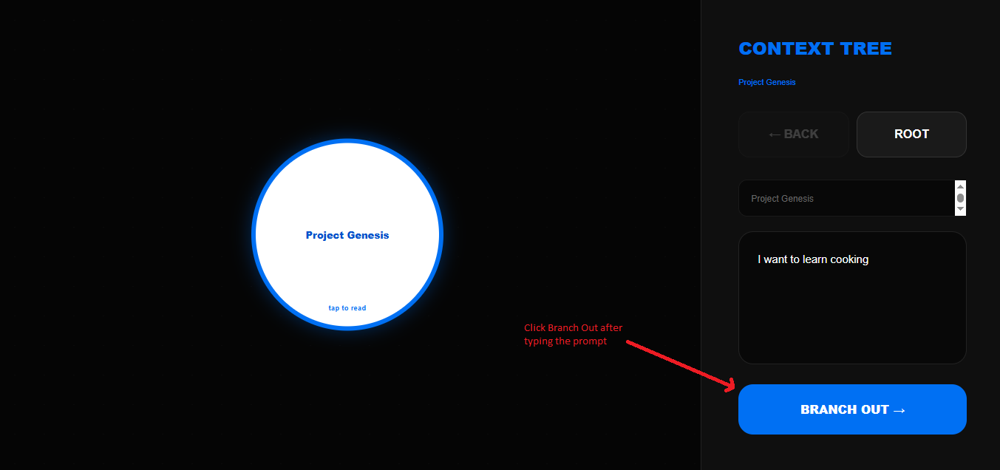
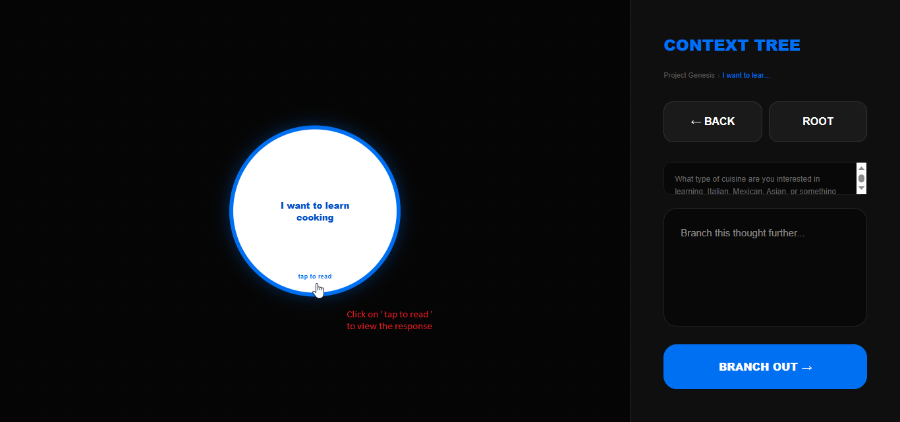
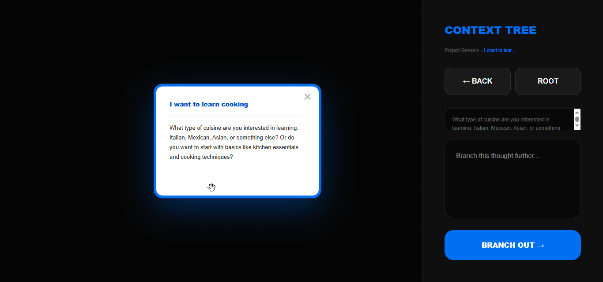
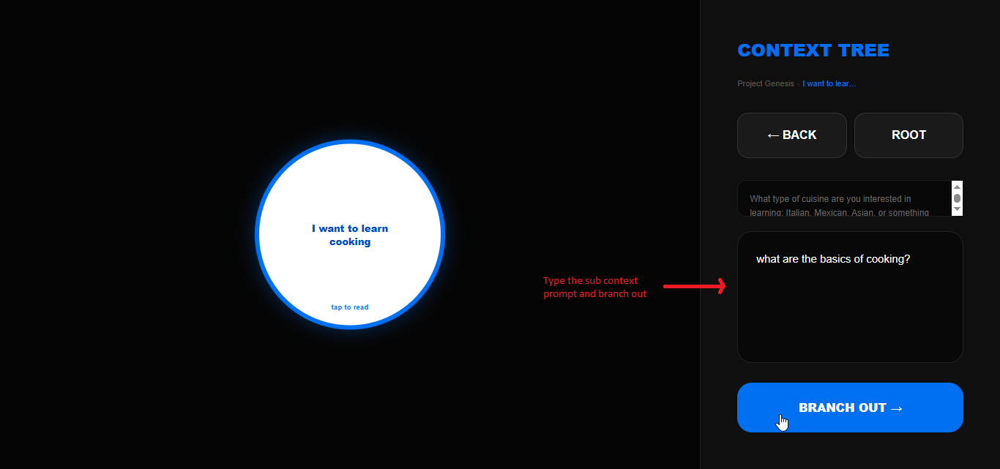
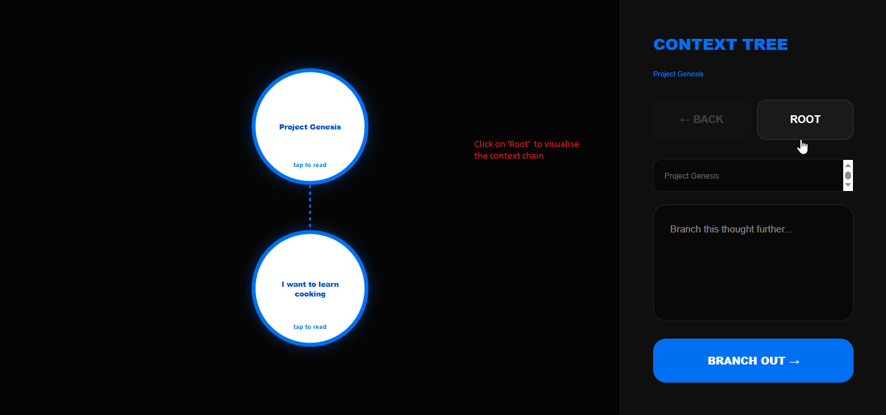
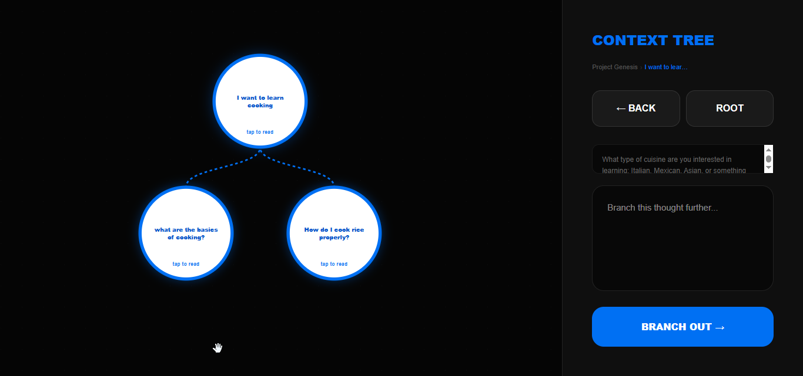

# AI Context Tree

An interactive visualization tool for exploring ideas and their contextual relationships through a hierarchical tree structure.

## Overview

The AI Context Tree is a web application that allows users to navigate concepts through expandable and collapsible nodes. The project explores a structured approach to organizing information, where each concept can branch into deeper contextual layers.

## Features

* Interactive tree visualization
* Expand and collapse nodes
* Hierarchical context exploration
* Responsive web interface
* Built with Next.js

## Technologies Used

* Next.js
* React
* JavaScript
* CSS

## Screenshots










## Run Locally

```bash
npm install
npm run dev
```

Open http://localhost:3000 in your browser.

## Future Improvements

* AI-assisted context generation
* Search functionality
* Persistent storage
* Export and sharing capabilities

## Author

Vignesh Murali
